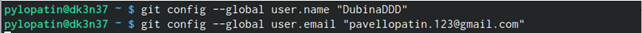
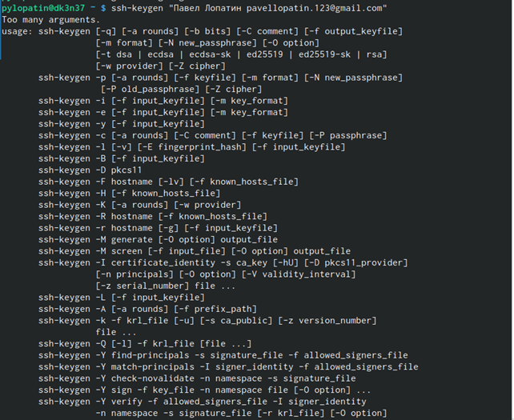
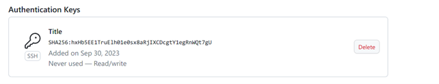
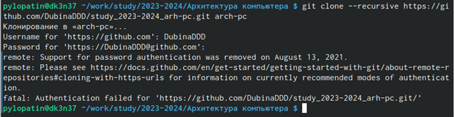
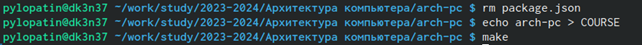
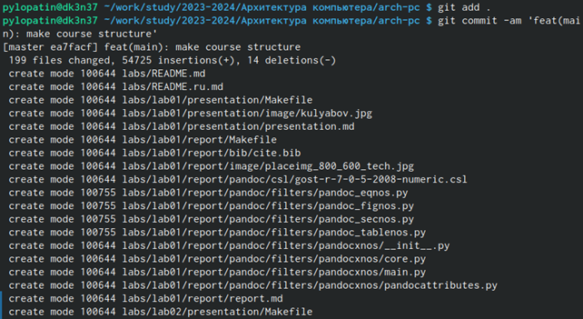
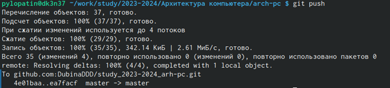
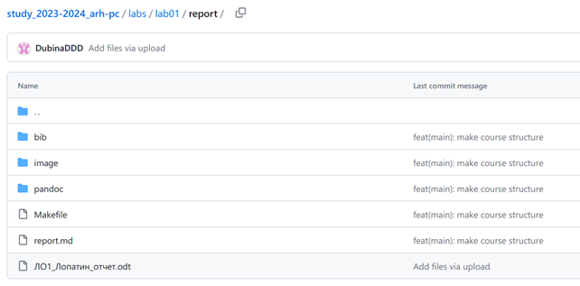

---
## Front matter
title: "Отчёт по лабораторной работе №2"
subtitle: "Дисциплина: архитектура компьютера"
author: "Лопатин Павел Юрьевич"

## Generic otions
lang: ru-RU
toc-title: "Содержание"

## Bibliography
bibliography: bib/cite.bib
csl: pandoc/csl/gost-r-7-0-5-2008-numeric.csl

## Pdf output format
toc: true # Table of contents
toc-depth: 2
lof: true # List of figures
lot: true # List of tables
fontsize: 12pt
linestretch: 1.5
papersize: a4
documentclass: scrreprt
## I18n polyglossia
polyglossia-lang:
  name: russian
  options:
	- spelling=modern
	- babelshorthands=true
polyglossia-otherlangs:
  name: english
## I18n babel
babel-lang: russian
babel-otherlangs: english
## Fonts
mainfont: PT Serif
romanfont: PT Serif
sansfont: PT Sans
monofont: PT Mono
mainfontoptions: Ligatures=TeX
romanfontoptions: Ligatures=TeX
sansfontoptions: Ligatures=TeX,Scale=MatchLowercase
monofontoptions: Scale=MatchLowercase,Scale=0.9
## Biblatex
biblatex: true
biblio-style: "gost-numeric"
biblatexoptions:
  - parentracker=true
  - backend=biber
  - hyperref=auto
  - language=auto
  - autolang=other*
  - citestyle=gost-numeric
## Pandoc-crossref LaTeX customization
figureTitle: "Рис."
tableTitle: "Таблица"
listingTitle: "Листинг"
lofTitle: "Список иллюстраций"
lotTitle: "Список таблиц"
lolTitle: "Листинги"
## Misc options
indent: true
header-includes:
  - \usepackage{indentfirst}
  - \usepackage{float} # keep figures where there are in the text
  - \floatplacement{figure}{H} # keep figures where there are in the text
---

**Цель работы**

Ознакомиться с принципами работы средств контроля версий. Настроить git для начала работы.  Используя  git,  создать  рабочее  пространство  и  репозиторий  курса,  после  чего загрузить файлы на github.

**Настройка github**

**Рис. 1.1** Создали учетную запись на сайте github

**Базовая настройка git**

{#fig:001 width=70%}

**Рис. 2.1** Указали имя и e-mail владельца репозитория

{#fig:001 width=70%}

**Рис. 2.2** Настройка utf-8 в выводе сообщений git

{#fig:001 width=70%}

**Рис. 2.3** Задали имя «Мастер» для начальной ветки

{#fig:001 width=70%}

**Рис. 2.4** Настроили параметры autocrlf и safecrlf

**Создание SSH ключа**

{#fig:001 width=70%}

**Рис. 3.1** Сгенерировали пару ключей(приватный и открытый)

{#fig:001 width=70%}

**Рис. 3.2** Скопировали из локальной консоли ключ в буфер обмена

{#fig:001 width=70%}

**Рис 3.3** Создали SSH ключ

{#fig:001 width=70%}

 **Создание рабочего пространства и репозитория курса**

**Рис. 4.1** Создали каталог для предмета «Архитектура компьютера»

{#fig:001 width=70%}

**Рис. 4.2** Создали репозиторий курса на основе шаблона через web-интерфейс github.

{#fig:001 width=70%}

**Рис. 4.3** Перешли в созданный репозиторий

{#fig:001 width=70%}

**Рис. 4.4** Клонировали созданный репозиторий

**Настройка каталога курса**

{#fig:001 width=70%}

**Рис. 5.1** Удалили лишние файлы и создали необходимые каталоги

{#fig:001 width=70%}

**Рис. 5.2** Ввели команды git add и git commit -am

{#fig:001 width=70%}

**Рис. 5.3** Ввели команду git push и отправили файлы на сервер

{#fig:001 width=70%}

**Задание для самостоятельной работы**

**Рис. 6.1** Загрузили отчет по выполнении первой лабораторной работы на github

{#fig:001 width=70%}

**Вывод**

Идеология и применение средств  контроля версий изучены. После базовой настройки git создали иерархию рабочего пространства в локальном репозитории и на странице github.

::: {#refs}
:::
